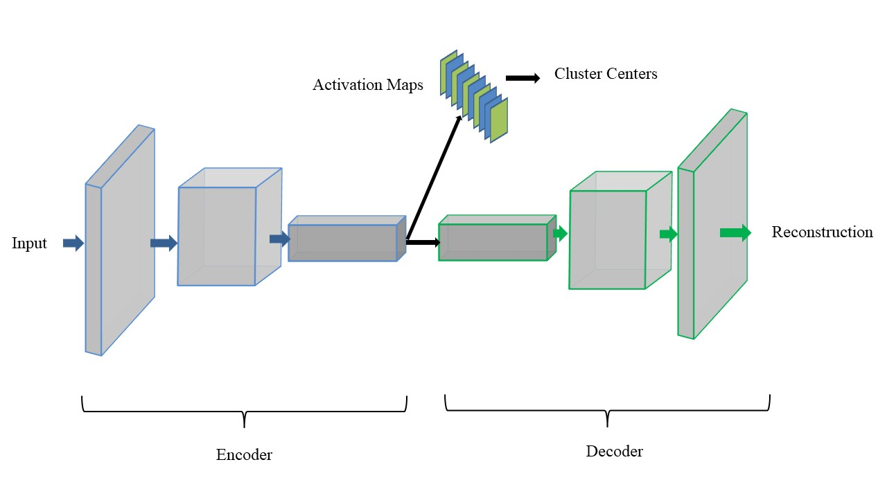

Deep Convolutional Clustering Autoencoder

The reopository contains deep convolutional clustering autoencoer method implementation with PyTorch. The code was developed as a part of Master's Thesis of Unsupervised Anomaly Detection using Convolutional Neural Networks from Fachhochschule Südwestfalen.

## Dependencies

| Framework | Version |
|-----------|---------|
| Numpy     | 1.18.5  |
| Pandas    | 1.0.4   |
| PyTorch   | 1.4.0   |
| Sklearn   | 0.24    |
| Matplotlib| 3.2.1   |

The code was written and tested on Python 3.7

## Methodology Discussion

Although anomaly detection is a highly researched topic with diverse research areas and application domains, the application of this domain on industrial process data has still not been thoroughly explored. The application of technologies like Internet of Things(IoT) have paved the way to solve complex industrial problems with the help of large amounts of information. Industrial systems are now intertwined with each other constantly sharing data among them. Vast quantities of this data is unlabeled, and it is a mammoth task to label the data manually. If there are anomalies present in the data it is even harder to find and label the anomalous samples. The objective of unsupervised anomaly detection solves this problem by partitioning the input data into distinct normal and anomalous regions.

DCCA is an unsupervised anomaly detection approach which jointly utilizes a Convolutional Autoencoder, and  the K-means clustering algorithm.

The encoder part of the autoencoder is used to map a low dimensional feature representation of the original data. The decoder is responsible for reconstructing the encoded data to the original form. The convolutional autoencoder is optimized using the error produced from the reconstructed data. A clustering algorithm (i.e., K-Means) is simultaneously being applied on the latent feature representation to initialize two cluster centers. This allows us to jointly optimize the network by combining an additional clustering loss. The clustering loss enforces the encoder to learn clustering friendly representation by minimizing the mean-squared error between the cluster centers and the data samples.

The latent representation of the activation maps are evaluated in terms of their accuracy. The activation maps produced from the clustering kernels showed better results in terms of clustering accuracy and separating the data into two distinct regions. During the joint optimization the decoder is constantly attached so that the reconstruction error is not ignored. This method of including the decoder throughout the training process avoids trivial solutions by keeping track of the reconstruction loss, and updating the network parameters accordingly.

